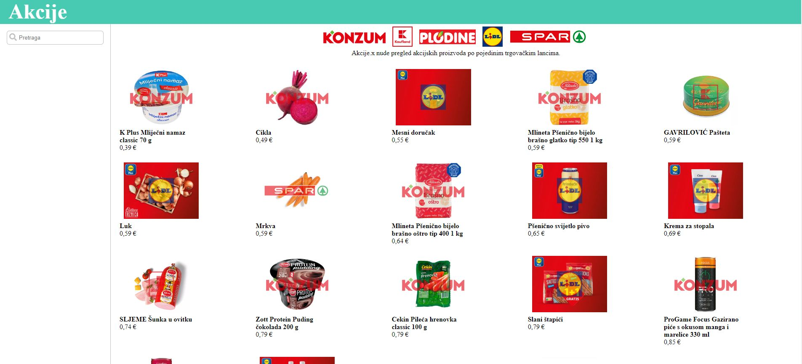

# Akcije

System for displaying discounted products from various stores in Croatia.

It consists of multiple store scrapers (Kaufland, Konzum, Lidl, Plodine, Spar) implemented with puppeteer, and simple Next.JS frontend for displaying products.



## Running

### .env

```
DATABASE_URL="<prisma db url>"
TEST="<true | false>" // If true, only first page will be scraped 
```

Database initialization

```
prisma:generate
prisma:migrate
```

Frontend

```
npm run frontend     
```

Scrapers

```
npm run scraper
```

Only specific scraper

```
npm run scraper Konzum
npm run scraper Kaufland 
npm run scraper Lidl
npm run scraper Plodine
npm run scraper Spar
```